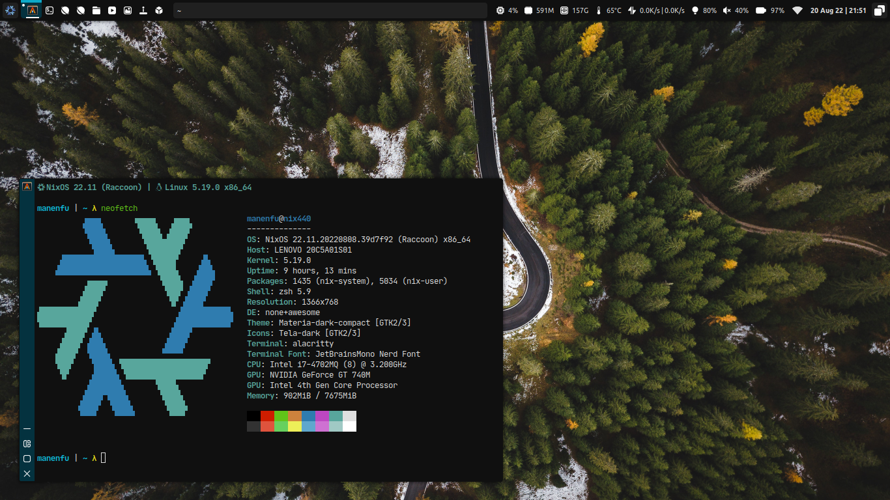

# tangible-desktop

Desktop configuration for various window managers.

## Desktops

### [Awesome](./desktop/awesome/)


### [DWM](./desktop/dwm/)


### [Hyprland](./desktop/hypr/)


## Installation

### NixOS with Flake

Install [Home Manager]([https://github.com/nix-community/home-manager]).

Then, enable the following options:
```nix
# flake.nix
{
  inputs = {
    nixpkgs.url = "github:NixOS/nixpkgs/nixos-unstable";
    home-manager = {
      url = "github:nix-community/home-manager/";
      inputs.nixpkgs.follows = "nixpkgs";
    };
    tangible = {
      url = "github:ManEnfu/tangible-desktop";
      inputs.nixpkgs.follows = "nixpkgs";
    };
  }; 
}

# home.nix
{ config, pkgs, lib, ...}: {
  desktop.tangible = {
    enable = true; # Enable Tangible Desktop configurations
    awesome.enable = true; # Export configuration for `awesome`
    dwm.enable = true; # Export configuration for `dwm`
    hyprland.enable = true; # Export configuration for `hyprland`
  }
}
```

### Other

- Install required softwares, themes and fonts.
- Copy scripts in `scripts` into `PATH` (e.g `~/.local/bin`).
- Install font `fonts/TangibleIcons.ttf`.
- Copy configuration files from `config` and `desktop` into `~/.config`.
