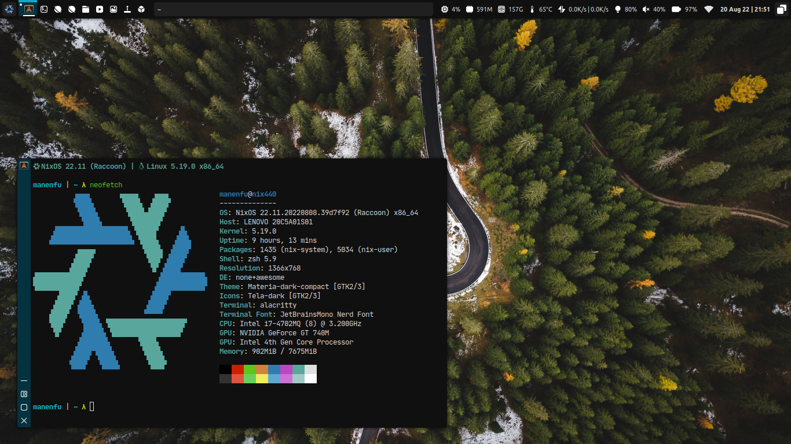

# Awesome

An extremely extensible X11 dynamic window manager, configured in Lua.

## Details
| Software | Functionality | Link |
| :--- | :--- | :--- |
| `awesome` | Window manager, built-in panel, built-in notification | [Link](https://github.com/awesomewm/awesome) |
| `brightnessctl` | Brightness control | [Link](https://github.com/Hummer12007/brightnessctl) | 
| `feh` | Image viewer and backgroud setter | [Link](https://feh.finalrewind.org/) |
| `i3lock` | Screen locker | [Link](https://i3wm.org/i3lock/) |
| `kitty` | Terminal emulator | [Link](https://github.com/kovidgoyal/kitty) |
| `lxpolkit` | Policykit provider | [Link](https://wiki.lxde.org/en/LXSession) |
| `libnotify` | Send notifications | [Link](https://gitlab.gnome.org/GNOME/libnotify) |
| `networkmanagerapplet` | Applet for NetworkManager | [Link](https://gitlab.gnome.org/GNOME/network-manager-applet/) |
| `pactl` | Audio Control (Part of PulseAudio) | [Link](http://www.pulseaudio.org/) | 
| `picom-jonaburg` | Compositor with nice animations | [Link](https://github.com/jonaburg/picom) |
| `redshift` | Color temperature adjuster | [Link](https://github.com/jonls/redshift) | 
| `rofi` | Menu & app launcher | [Link](https://github.com/davatorium/rofi) |
| `scrot` | Screenshot | [Link](https://github.com/resurrecting-open-source-projects/scrot) |
| `xcolor` | Color picker | [Link](https://github.com/Soft/xcolor) |
| `xclip` | Clipboard | [Link](https://github.com/astrand/xclip) |
