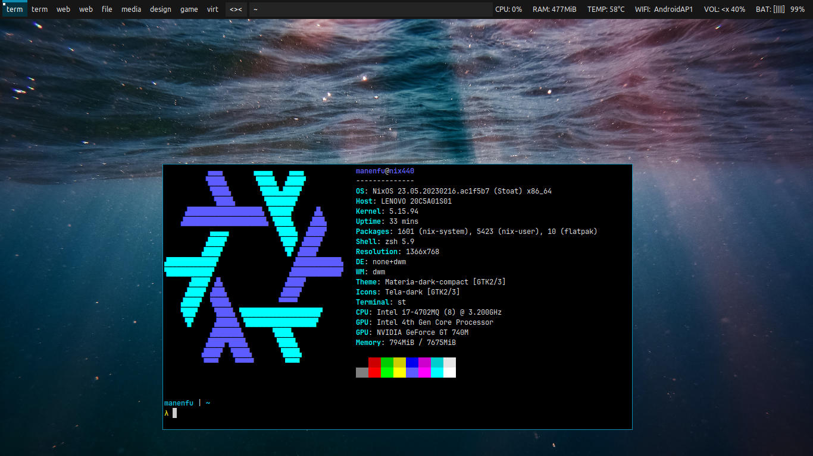

# DWM

A simple X11 dynamic window manager, configured by editing it's source code.

## Details

### Software Requirements

| Software | Functionality | Link |
| :--- | :--- | :--- |
| `dwm` | Window manager, built-in panel (patched) | [Link](https://dwm.suckless.org/) |
| `brightnessctl` | Brightness control | [Link](https://github.com/Hummer12007/brightnessctl) | 
| `dmenu` | Menu & app launcher (patched) | [Link](https://tools.suckless.org/dmenu) |
| `dwmblocks` | Panel status (patched) | [Link](https://github.com/torrinfail/dwmblocks) |
| `feh` | Image viewer and backgroud setter | [Link](https://feh.finalrewind.org/) |
| `i3lock` | Screen locker | [Link](https://i3wm.org/i3lock/) |
| `st` | Terminal emulator (patched) | [Link](https://st.suckless.org/) |
| `lxpolkit` | Policykit provider | [Link](https://wiki.lxde.org/en/LXSession) |
| `libnotify` | Send notifications | [Link](https://gitlab.gnome.org/GNOME/libnotify) |
| `pactl` | Audio Control (Part of PulseAudio) | [Link](http://www.pulseaudio.org/) | 
| `pcmanfm-qt` | File manager | [Link](https://github.com/lxqt/pcmanfm-qt) |
| `picom-jonaburg` | Compositor with nice animations | [Link](https://github.com/jonaburg/picom) |
| `redshift` | Color temperature adjuster | [Link](https://github.com/jonls/redshift) | 
| `scrot` | Screenshot | [Link](https://github.com/resurrecting-open-source-projects/scrot) |
| `tangible-desktop-scripts` | Scripts available in `/scripts` folder | [Link](../../scripts/) |
| `xcolor` | Color picker | [Link](https://github.com/Soft/xcolor) |
| `xclip` | Clipboard | [Link](https://github.com/astrand/xclip) |

### Fonts
| Font | Link |
| :--- | :--- |
| Ubuntu | [Link](http://font.ubuntu.com/) |
| JetBrainsMono Nerd Font | [Link](https://nerdfonts.com/) |

### Themes
| Theme | Link |
| :--- | :--- |
| Kvantum | [Link](https://github.com/tsujan/Kvantum) |
| Materia GTK Theme | [Link](https://github.com/nana-4/materia-theme) |
| Materia Kvantum Theme | [Link](https://github.com/PapirusDevelopmentTeam/materia-kde) |
| Tela Icon Theme | [Link](https://github.com/vinceliuice/tela-icon-theme) |
| Quintom Cursor Theme | [Link](https://gitlab.com/Burning_Cube/quintom-cursor-theme) |
