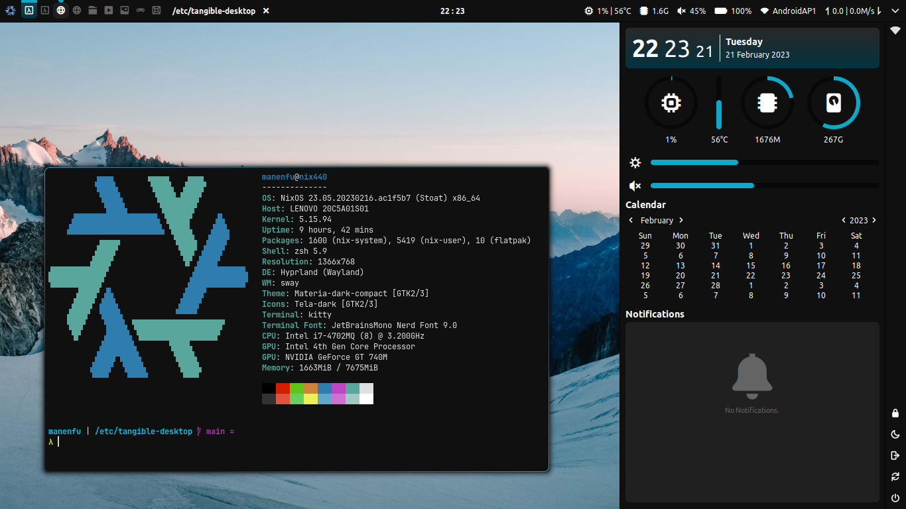

# Hyprland

A tiling Wayland compositor with eye candy stuffs. This is where I experiment stuffs.
Extremely bleeding edge, use at your own risk.

## Details

### Software Requirements

| Software | Functionality | Link |
| :--- | :--- | :--- |
| `Hyprland` | Compositor | [Link](https://github.com/hyprwm/Hyprland) |
| `brightnessctl` | Brightness control | [Link](https://github.com/Hummer12007/brightnessctl) | 
| `dunst` | Notification daemon | [Link](https://github.com/dunst-project/dunst) |
| `eww` | Panel & widgets | [Link](https://github.com/elkowar/eww) |
| `grim` | Screenshot, color picker | [Link](https://github.com/emersion/grim) |
| `hyprpicker` | Color picker | [Link](https://github.com/hyprwm/hyprpicker) |
| `kitty` | Terminal emulator | [Link](https://github.com/kovidgoyal/kitty) |
| `lxpolkit` | Policykit provider | [Link](https://wiki.lxde.org/en/LXSession) |
| `libnotify` | Send notifications | [Link](https://gitlab.gnome.org/GNOME/libnotify) |
| `networkmanagerapplet` | Applet for NetworkManager | [Link](https://gitlab.gnome.org/GNOME/network-manager-applet/) |
| `pactl` | Audio Control (Part of PulseAudio) | [Link](http://www.pulseaudio.org/) | 
| `pcmanfm-qt` | File manager | [Link](https://github.com/lxqt/pcmanfm-qt) |
| `pipewire` | Multimedia pipeline | [Link](https://pipewire.org/) | 
| `python3` | Interpreter for several scripts | [Link](https://www.python.org/) |
| `python3-pulsectl` | Python library for audio control | [Link](https://pypi.python.org/pypi/pulsectl/) |
| `python3-watchdog` | Python library for event handling | [Link](https://github.com/gorakhargosh/watchdog) |
| `rofi-wayland` | Menu & app launcher with Wayland support | [Link](https://github.com/lbonn/rofi) |
| `slurp` | Screenshot, color picker | [Link](https://github.com/emersion/slurp) |
| `swaybg` | Wallpaper setter | [Link](https://github.com/swaywm/swaybg) |
| `swayidle` | Idle manager | [Link](https://github.com/swaywm/swayidle) |
| `swaylock` | Screen locker | [Link](https://github.com/swaywm/swaylock) |
| `tangible-desktop-scripts` | Scripts available in `/scripts` folder | [Link](../../scripts/) |
| `waybar` | Panel & system tray | [Link](https://github.com/alexays/waybar) |
| `wireplumber` | Policy manager for Pipewire | [Link](https://pipewire.org/) | 
| `wl-clipboard` | Clipboard | [Link](https://github.com/bugaevc/wl-clipboard) |
| `xdg-desktop-portal-wlr` | xdg-desktop-portal backend | [Link](https://github.com/emersion/xdg-desktop-portal-wlr) |

### Fonts
| Font | Link |
| :--- | :--- |
| Ubuntu | [Link](http://font.ubuntu.com/) |
| Ubuntu Nerd Font | [Link](https://nerdfonts.com/) |
| JetBrainsMono Nerd Font | [Link](https://nerdfonts.com/) |
| TangibleIcons | [Link](../../fonts/) |

### Themes
| Theme | Link |
| :--- | :--- |
| Kvantum | [Link](https://github.com/tsujan/Kvantum) |
| Materia GTK Theme | [Link](https://github.com/nana-4/materia-theme) |
| Materia Kvantum Theme | [Link](https://github.com/PapirusDevelopmentTeam/materia-kde) |
| Tela Icon Theme | [Link](https://github.com/vinceliuice/tela-icon-theme) |
| Quintom Cursor Theme | [Link](https://gitlab.com/Burning_Cube/quintom-cursor-theme) |

## Keybindings

### General

| Keybind | Action |
| :---    | :---   |
| <kbd>Super + S</kbd>          | Show keybindings |
| <kbd>Super + Shift + R</kbd>  | Reload |
| <kbd>Super + Shift + Q</kbd>  | Quit |

### Launcher

| Keybind | Action |
| :---    | :---   |
| <kbd>Super + Enter</kbd>      | Open terminal |
| <kbd>Super + P</kbd>          | Show app launcher |
| <kbd>Super + R</kbd>          | Show run prompt |
| <kbd>Super + W</kbd>          | Show window selector |
| <kbd>Super + Shift + P</kbd>  | Show logout menu |
| <kbd>Super + O</kbd>          | Show side panel |
| <kbd>Super + A</kbd>          | Open file manager |
| <kbd>Super + Ctrl + C</kbd>   | Pick color |

### Window

| Keybind | Action |
| :---    | :---   |
| <kbd>Super + Shift + C</kbd>      | Close window |
| <kbd>Super + F</kbd>              | Toggle fullscreen |
| <kbd>Super + M</kbd>              | Maximize / restore window |
| <kbd>Super + V</kbd>              | Toggle floating  |
| <kbd>Super + Tab</kbd>            | Cycle windows |
| <kbd>Super + Arrow / HJKL</kbd>   | Move window focus |
| <kbd>Super + Shift + Arrow / HJKL</kbd>   | Move window |
| <kbd>Super + Control + Arrow / HJKL</kbd> | Resize window |
| <kbd>Super + G</kbd>              | Toggle window grouping |
| <kbd>Super + Tab</kbd>            | Cycle window in group |
| <kbd>Super + ,</kbd>              | Cycle back window in group |
| <kbd>Super + .</kbd>              | Cycle window in group |

### Workspace / Tag

| Keybind | Action |
| :---    | :---   |
| <kbd>Super + [Num]</kbd>          | Switch to workspace |
| <kbd>Super + Shift + [Num]</kbd>  | Move window to workspace |
| <kbd>Super + PgUp</kbd>           | Switch to previous workspace |
| <kbd>Super + PgDn</kbd>           | Switch to next workspace |

### Screenshot

| Keybind | Action |
| :---    | :---   |
| <kbd>Print</kbd>          | Take screenshot |
| <kbd>Shift + Print</kbd>  | Take screenshot (select area) |
| <kbd>Ctrl + Print</kbd>   | Take screenshot of active window |

### Volume and Media Control

| Keybind | Action |
| :---    | :---   |
| <kbd>Super + [</kbd>          | Lower volume |
| <kbd>Super + ]</kbd>          | Raise volume |
| <kbd>Super + \\</kbd>         | Toggle volume |
| <kbd>Super + Shift + [</kbd>  | Play previous |
| <kbd>Super + Shift + ]</kbd>  | Play next |
| <kbd>Super + Shift + \\</kbd> | Play/pause current |

### Brightness and Light Filter

| Keybind | Action |
| :---    | :---   |
| <kbd>Super + Ctrl + [</kbd>   | Lower brightness |
| <kbd>Super + Ctrl + ]</kbd>   | Raise brightness |
